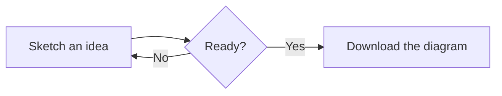
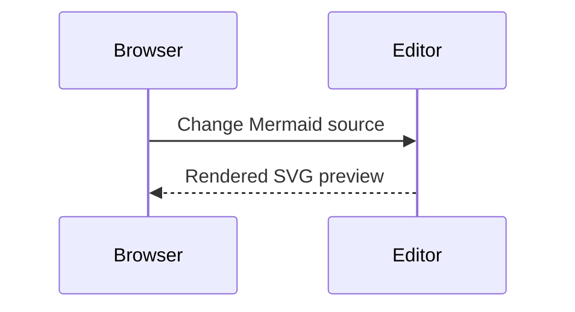
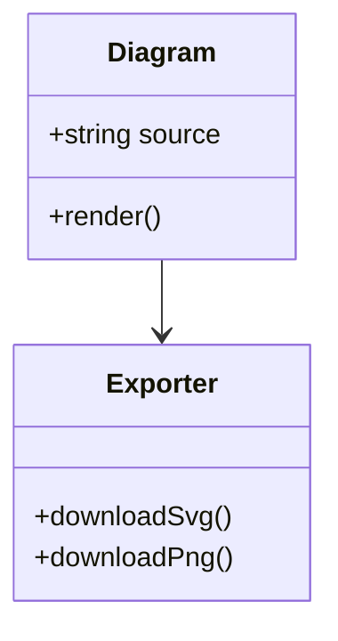

# Mermaid quick start

Mermaid diagrams are text. Paste one of these examples into FreeMermaid, then edit the labels and relationships.

## Flowchart

`LR` means left-to-right; use `TB` for top-to-bottom. Node IDs such as `Idea` are identifiers, while the text in brackets is the label.

## Sequence diagram

## Class diagram

## Save the source

Choose **Source** to download your text as `diagram.mmd`. Keeping the text alongside a document or source repository makes changes reviewable and editable.

## Learn the complete language

FreeMermaid ships the full Mermaid package, but it deliberately does not duplicate Mermaid’s extensive language documentation. Use these maintained upstream references:

- [Mermaid introduction and diagram types](https://mermaid.ai/open-source/intro/)
- [Flowchart syntax](https://mermaid.ai/open-source/syntax/flowchart.html)
- [Mermaid usage and configuration](https://mermaid.ai/open-source/config/usage.html)

FreeMermaid renders with strict security and without HTML labels or click callbacks. If an upstream example relies on interactive callbacks or HTML labels, it will not behave the same way here.
